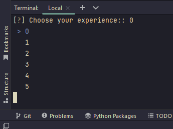
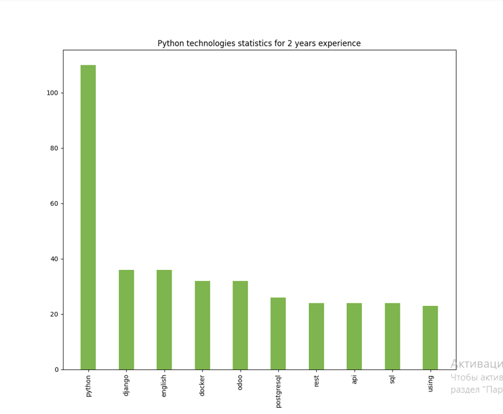

# Technologies statistics
The program collects statistics of the most popular technologies among employers' requests.

## Installing

Python3 must be already installed!

```shell 
git clone git@github.com:anastasia-martyniuk/taxi-service.git
python -m venv venv
source venv/bin/activate (Unix)
or
venv/Scripts/activate (Windows)
pip install -r requirements.txt
python main.py
```

After executing all the commands, the following window will appear in the terminal, where you need to choose your experience:



## Features

The program builds a chart of the 10 most popular technologies:



